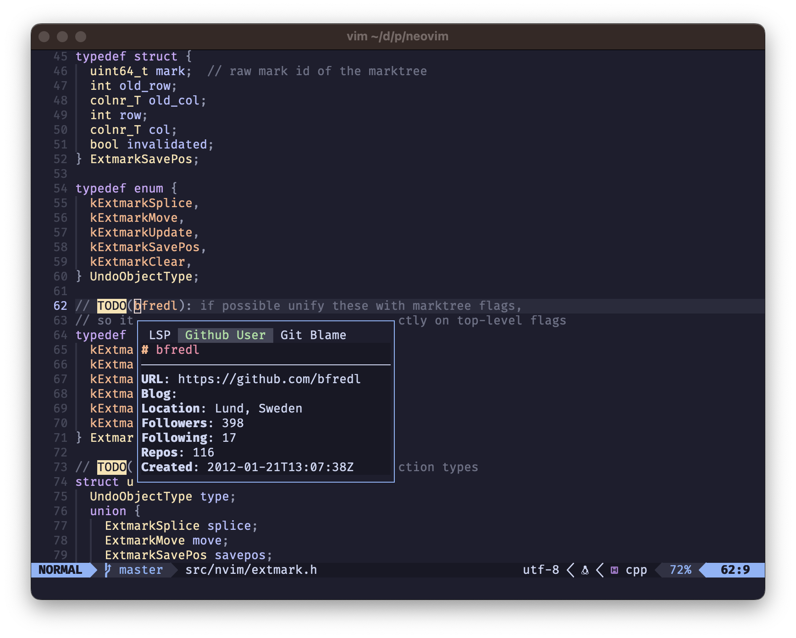
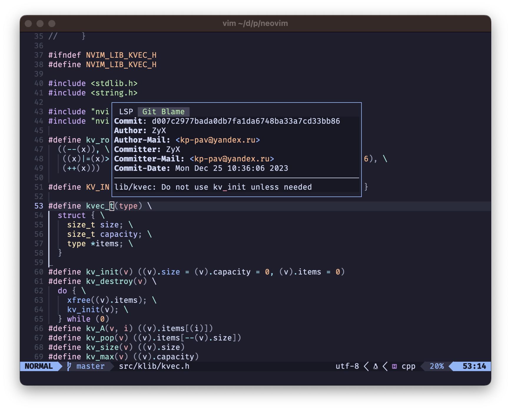

# hovercraft.nvim

`hovercraft.nvim` is a plug and play framework for writing custom hover provider. It brings a few
providers out of the box, such as a LSP, as well as a Dictionary.

It allows for basic customizations of the hover window (such as defining custom borders, set the max
width and so on).

This plugin is heavily inspired by [hover.nvim](https://github.com/lewis6991/hover.nvim)! Many kudos
to lewis6991 for providing inspiration.


## Setup

via lazy.nvim:
```lua
{
  'patrickpichler/hovercraft.nvim',

  dependencies = {
    { 'nvim-lua/plenary.nvim' },
  },

  -- this is the default config and can be skipped
  opts = function()
    return {
      providers = {
        providers = {
          {
            'LSP',
            require('hovercraft.provider.lsp').new(),
          },
          {
            'Man',
            require('hovercraft.provider.man').new(),
          },
          {
            'Dictionary',
            require('hovercraft.provider.dictionary').new(),
          },
        }
      },

      window = {
        border = 'single',
      },

      keys = {
        { '<C-u>',   function() require('hovercraft').scroll({ delta = -4 }) end },
        { '<C-d>',   function() require('hovercraft').scroll({ delta = 4 }) end },
        { '<TAB>',   function() require('hovercraft').hover_next() end },
        { '<S-TAB>', function() require('hovercraft').hover_next({ step = -1 }) end },
      }
    }
  end,
}
```

## Configuration

### Show hover dialog

There are various ways of displaying the hover popup. The simplest is the `hover` method. It takes
an option table, that allows you to specify what provider should be shown.

Example:
```lua
require('hovercraft').hover({ current_provider = "LSP" })
```

If you want to cycle through all available providers, hovercraft offers a `hover_next` function. It
takes options to specify how many steps it should move forward from the current shown provider. This
also allows for negative steps, to cycle backwards. You can disable the cycling by setting `cycle =
false`.

Example:
```lua
require('hovercraft').hover_next({ step = -1, cycle = false })
```

Last, but not least, you can also let hovercraft open the vim selection dialog, so that you can
choose which provider to show. This is archieved by the `hover_select` method.

Example:
```lua
require('hovercraft').hover_select()
```

### Keys

The keys you specify in the `keys` section of the config, are automatically mounted, as soon as
a hovercraft popup is shown. Once the popup is hidden again, the previous keymappings will be
re-installed. This allows you to overload certain keys.

### Tab order

The order of tabs is controlled by the `priority` you can pass in either via the config table, or
the `register` function When you omit it, `hovercraft.nvim` will automatically handle it for you.

For the config table, the priority will be based the index of the provider. The exact formula is
`90000 + (i * 10)`. This means that the first provider in the provider map will have a priority of
`90000 + (1 * 10) = 90010`.

If you register a provider via the `register` function and you omit the priority, `hovercraft.nvim`
will take the highest know priority (it starts with `1000` though) and adds `10`. This might be
subject to change, since I need to see if this works as nicely as hoped.


### Local instances

`hovercraft.nvim` features both a global instance, as well as local instances. This means, that if
you want to configure a special hovercraft for e.g. a certain set of buffer, you can do this. Simply
call `require('hovercraft.instance').new(<opts>)` to create a new instance. It behaves the same as
the global instance, only that of course all methods must be called on it.

Example:
```lua
local my_hovercraft = require('hovercraft.instance').new({
    providers = {
        providers = {
            {'Dictionary', require('hovercraft.provider.dictionary').new()}
        }
    }
})

vim.keymap.set('n', '<leader>k', function() my_hovercraft:hover() end)
```

## Providers

### LSP
`require('hovercraft.provider.lsp')`


Builtin LSP

### Dictionary
`require('hovercraft.provider.dictionary')`


Shows definitions for valid words, by querying [dictionaryapi.dev](https://dictionaryapi.dev)

### ManPage
`require('hovercraft.provider.man')`


Shows man page definitions of word under cursor for C, sh, zsh, tcl, fish and make.

### Github Issue
`require('hovercraft.provider.github.issue')`


Shows details about the issue under the cursor. It gets enabled for either `#(\d+)`, which will try
to get the issue details by figuring out the current github repo, or `(\w+)/(\w+)#(\d+)`, which
specifies the repo of the issue.

The logic for detecting the current Github project is based the remotes of the local git project. We
fetch the current remote url by running `git ls-remote --get-url`. Then we try to extract the Github
repo name. If the repo has no issues enabled, we try getting it from the parent repository.

### Github Repo
`require('hovercraft.provider.github.repo')`


Fetches details about the repo from Github and diplays them. You can disable fetching the repo
readme by passing in `fetch_readme = false` when calling the `new` method on the provider.

Examples for when this provider activates:
* `https://github.com/neovim/neovim`
* `git@github.com:neovim/neovim.git`

### Github User
`require('hovercraft.provider.github.user')`



Fetches details about the user from Github and display them. The regex for it to trigger is something
along the line of `(?:TODO|FIX|FIXME)\(@?([\w_-]*)\)`. It also works for organizations.

Here are some examples:
* `https://github.com/neovim`
* `-- TODO(@patrichpichler): this is a test`

### Git Blame
`require('hovercraft.provider.git_blame')`



Shows details from Git blame about the current line.

You can disble it to also display the commit message, by passing in `show_commit_message=false` when
constructing the provider.

## Creating a custom hover provider

There are multiple ways of registering a custom hover provider. The simplest is by passing in a
function as the second argument in the providers array. `hovercraft.nvim` expects the following
function signature:

```lua
---@alias Hovercraft.Provider.Function fun(opts: Hovercraft.Provider.ExecuteOptions, done: fun(result:Hovercraft.Provider.ExecuteResult))

--- @class Hovercraft.Provider.ExecuteOptions
--- @field bufnr integer
--- @field pos {[1]: integer, [2]: integer} tuple of [row, col]
--
--- @class Hovercraft.Provider.ExecuteResult
--- @field lines? string[]
--- @field filetype? string
```

The `done` callback is required to communicate back results, as the function will be called
asynchronous.

Besides a function, you can also pass it a table that implements the provider interface. Here is the
interface definition:

```lua
---@alias Hovercraft.Provider.ExecuteFunction fun(self: Hovercraft.Provider, opts?: Hovercraft.Provider.ExecuteOptions, done: fun(result: Hovercraft.Provider.ExecuteResult))

---@class Hovercraft.Provider
---@field is_enabled fun(self: Hovercraft.Provider, bufnr: integer): boolean
---@field execute Hovercraft.Provider.ExecuteFunction
```

The most notable difference is, that with a table provider, you have the possibility to enable it
based on the `is_enabled` function returning `true`.

Here is an example:

dummy_text.lua
```lua
local M = {}

local Provider = {}
Provider.__index = Provider

function Provider:is_enabled()
  return true
end

function Provider:execute(_, done)
  done({ lines = self.lines, filetype = self.filetype })
end

function M.new(lines, filetype)
  filetype = filetype or 'markdown'

  return setmetatable({
    lines = lines,
    filetype = filetype
  }, Provider)
end

return M
```

```lua
{
  'patrickpichler/hovercraft.nvim',

  dependencies = {
    { 'nvim-lua/plenary.nvim' },
  },

  -- this is the default config and can be skipped
  opts = function()
    return {
      providers = {
        providers = {
          {
            'Dummy',
            function(opts, done)
              done({ lines = { 'This', 'is *great*' }, filetype = 'markdown' })
            end,
          },
          {
            'Dummy1',
            require('dummy').new({ 'Hello' })
          },
        }
      },
    }
  end,
}
```

## Why

A few weeks ago I discovered [hover.nvim](https://github.com/lewis6991/hover.nvim) and thought the
idea is amazing! Sadly it didn't fully fit my workflow. Since I wanted to get more into neovim
plugin development, I thought this is it. Hence I created `hovercraft.nvim`.
